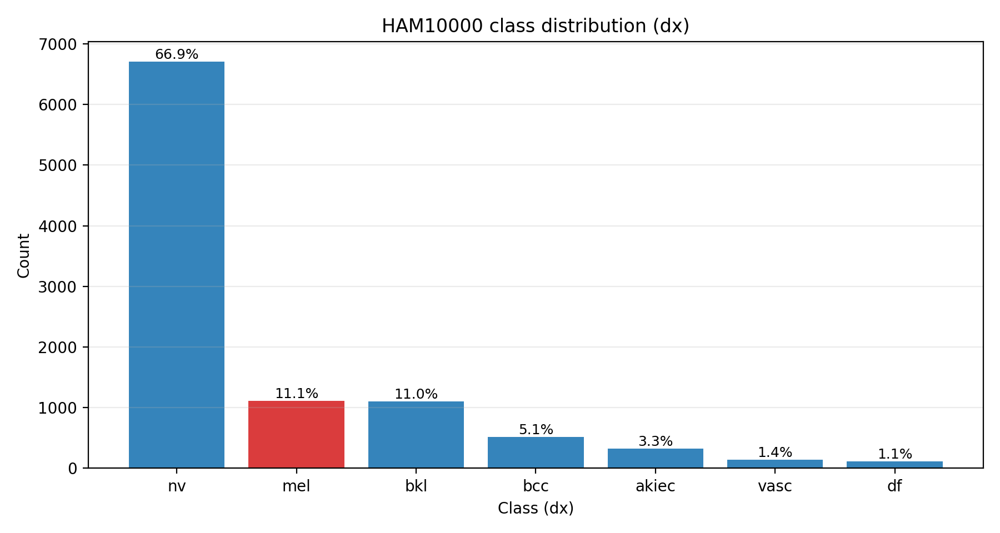
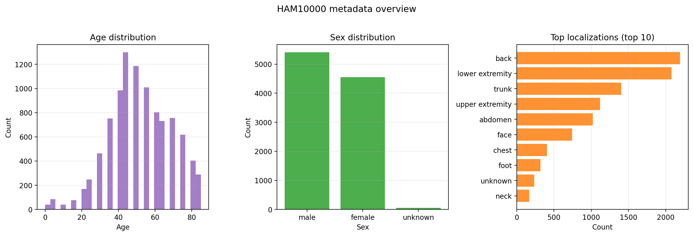
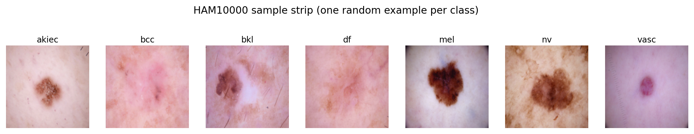
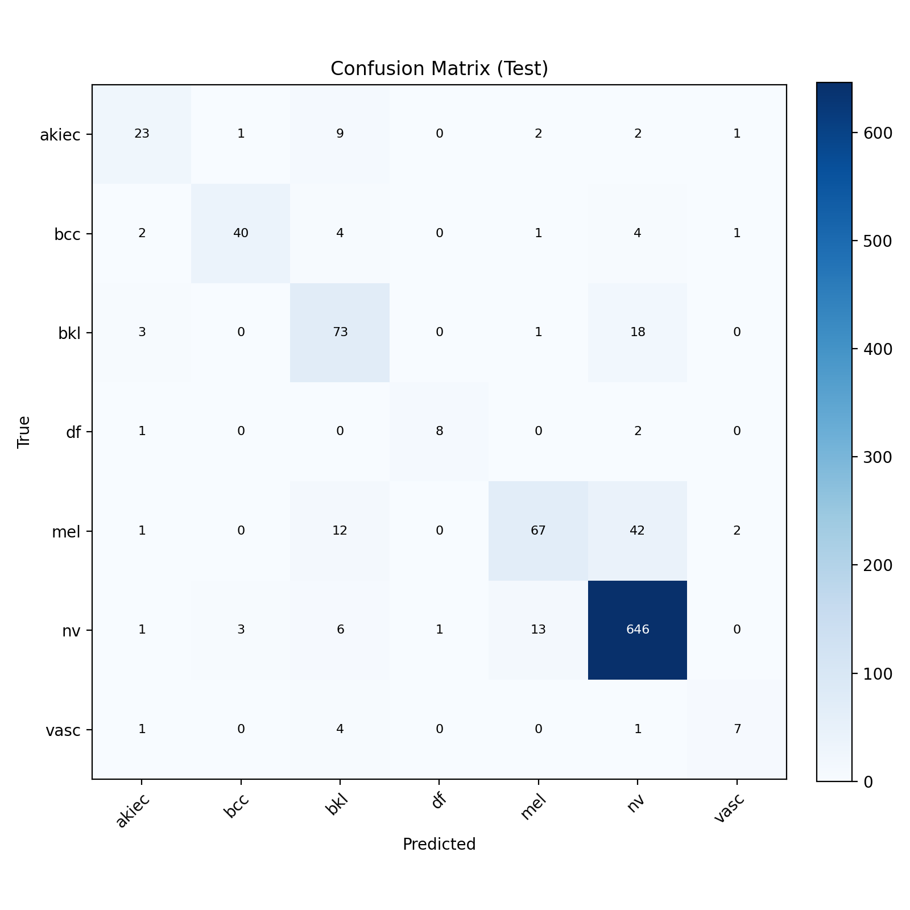
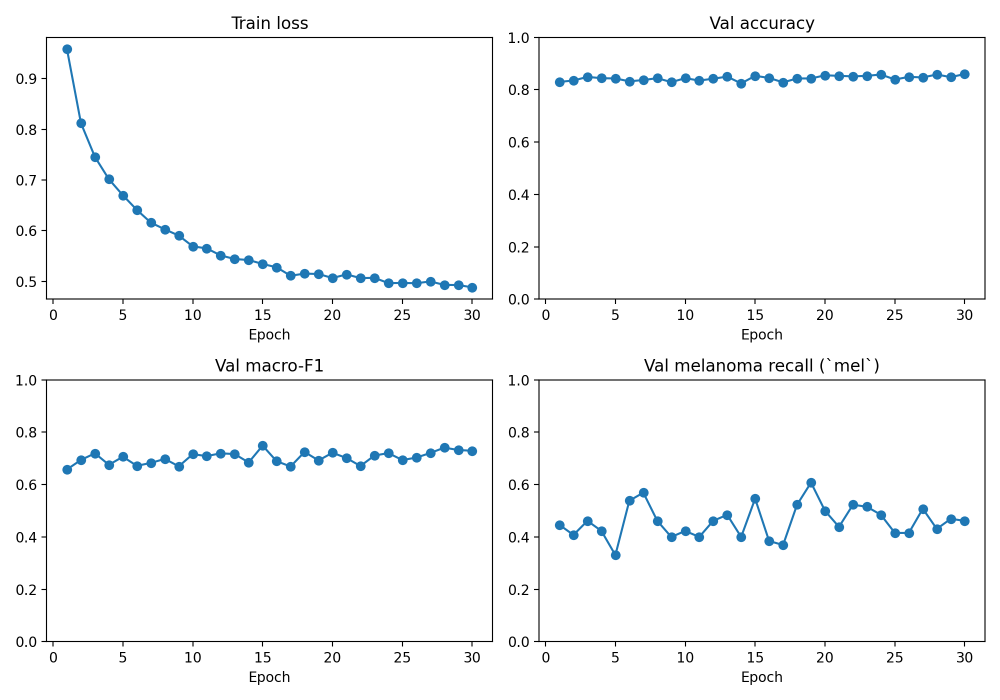
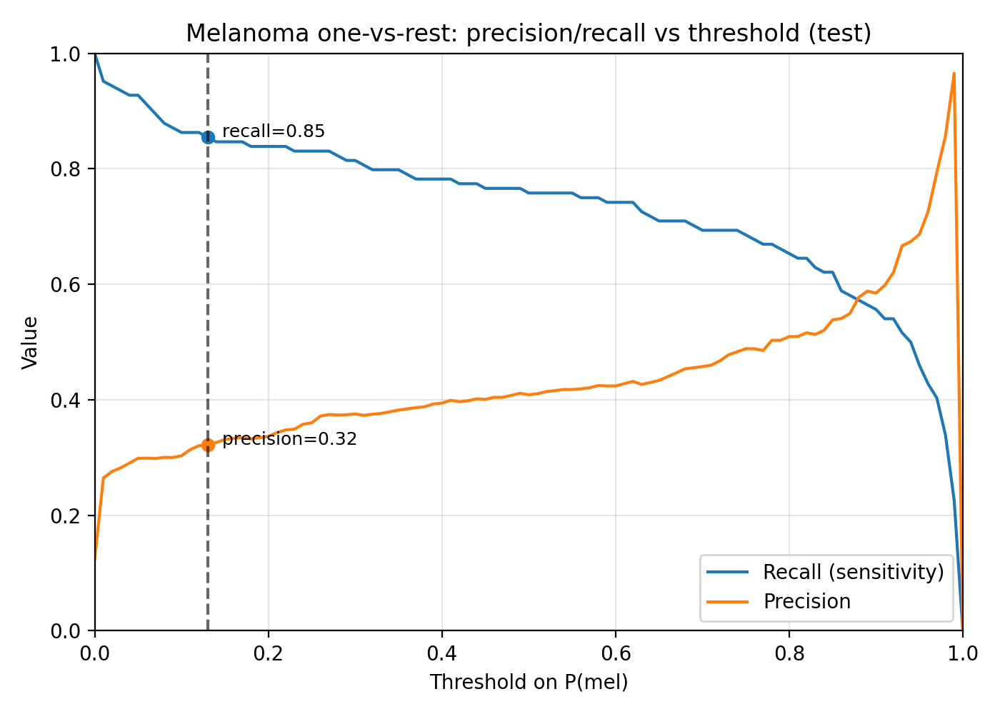
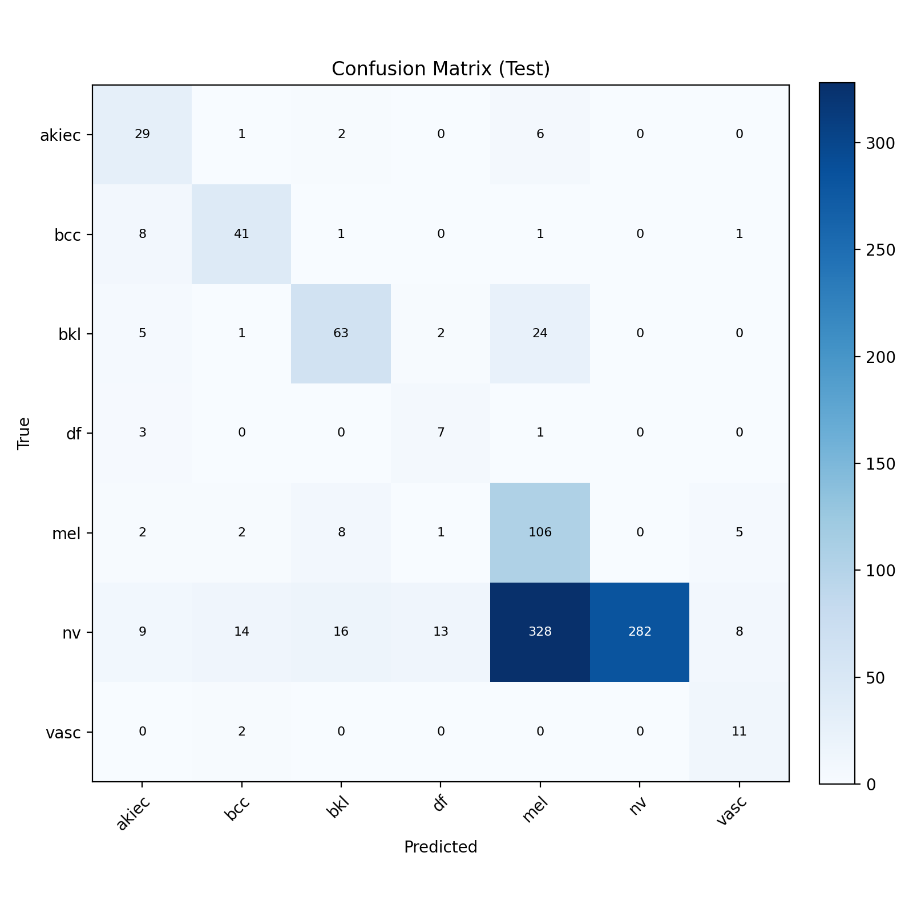
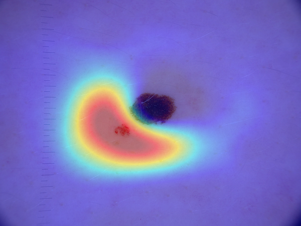
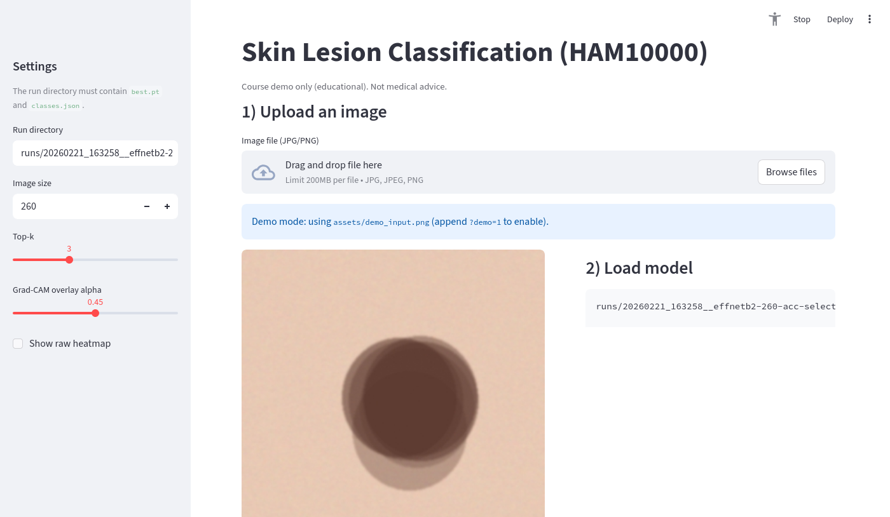

# Project Report — AI-Powered Skin Lesion Classification for Melanoma Detection (DSCI 498)

This report is written for course submission. It documents the dataset, methods, experiments, results, analysis, and a runnable demo app.

## Abstract

I built an end-to-end deep learning system to classify dermatoscopic skin lesion images from the **HAM10000** dataset (7 diagnostic categories). The project emphasizes both overall performance under severe class imbalance and **melanoma sensitivity** (recall for `mel`) as a safety-critical metric. I evaluate multiple imbalance-handling strategies, report confusion matrices and per-class recall, add threshold-based melanoma detection analysis using `P(mel)`, and provide qualitative interpretability via Grad-CAM. A Streamlit demo app demonstrates real-time image upload, prediction, and Grad-CAM visualization.

## Table of contents

- [1. Problem statement](#1-problem-statement)
- [2. Dataset](#2-dataset)
- [3. Methods](#3-methods)
- [4. Experiments](#4-experiments)
- [5. Results and analysis](#5-results-and-analysis)
- [6. Interpretability (Grad-CAM)](#6-interpretability-grad-cam)
- [7. Demo app (Streamlit)](#7-demo-app-streamlit)
- [8. Limitations and ethical note](#8-limitations-and-ethical-note)
- [9. Reproducibility](#9-reproducibility)

## 1. Problem statement

Skin lesion classification is a high-impact application of computer vision. The key challenge in this dataset is **class imbalance** (a large majority of benign nevi) and visually overlapping lesion appearance. For melanoma detection, false negatives are particularly concerning, so I explicitly track melanoma sensitivity and also analyze threshold-based operating points using the model’s `P(mel)` output.

## 2. Dataset

I use HAM10000 (10,015 images, 7 classes). Labels use the `dx` field:
`akiec`, `bcc`, `bkl`, `df`, `mel`, `nv`, `vasc`.

### 2.1 Dataset statistics (tracked figures)

*Figure 1. Class distribution of HAM10000 (`dx`). The dataset is highly imbalanced (dominant `nv`), motivating macro-F1 and melanoma-focused evaluation in addition to accuracy.*

*Figure 2. Metadata overview (age, sex, and top-10 localizations). These covariates can contribute to dataset bias and should be considered when interpreting results.*

### 2.2 Sample examples

*Figure 3. One random example per class (qualitative). Visual overlap across classes explains why misclassifications occur and why thresholding can be useful for sensitivity-first operation.*

Split strategy (implementation detail): I use a lesion-wise grouped split by `lesion_id` into train/val/test with a fixed seed (to reduce leakage from multiple images of the same lesion).

## 3. Methods

### 3.1 CNN classifier

I train a CNN image classifier using EfficientNet backbones with ImageNet-style normalization. The model outputs 7-class logits, and probabilities are obtained via softmax.

### 3.2 Handling class imbalance

I evaluate multiple imbalance-handling strategies:
- **Class-weighted cross-entropy** (baseline)
- **Weighted sampling** (to rebalance minibatches)
- **Melanoma-weighted loss** (explicitly prioritizing `mel` recall)

### 3.3 Threshold-based melanoma detection (one-vs-rest)

Beyond top-1 multiclass prediction, I treat `P(mel)` as a melanoma detection score and sweep thresholds to obtain precision/recall trade-offs and a suggested operating point (e.g., recall ≥ 0.85).

### 3.4 Interpretability (Grad-CAM)

Grad-CAM provides qualitative heatmaps showing image regions most influencing the predicted class.

### 3.5 Optional generative augmentation (cVAE)

I also include a conditional VAE to generate synthetic samples for an augmentation ablation (tracked in `vae_samples_grid.png`).

## 4. Experiments

I report:
- test accuracy
- test macro-F1
- test per-class recall (including melanoma sensitivity = recall for `mel`)

All tracked experiment outputs (tables/plots) are committed under `results/`. The full run directories (including checkpoints) are kept locally under `runs/`.

## 5. Results and analysis

### 5.1 “Hard targets” (milestone-style goals)

The milestone targets in `info.md` are not strict KPIs, but I tried to reach them:

- **Test accuracy > 0.85**: achieved by the accuracy-focused EfficientNet-B2 @ 260px run (`summary_effnetb2_260_acc.md`).
- **Melanoma sensitivity (recall for `mel`) > 0.85**: achieved by the sensitivity-first run under top-1 classification (`summary_effnetb2_260_mel_sampler.md`), and also achievable via thresholding `P(mel)` depending on the operating point.

Important nuance: these targets are achieved by **different operating modes** (different runs / settings). I therefore present both a high-accuracy classifier and a sensitivity-first operating mode via threshold analysis.

### 5.2 Summary table (key tracked runs)

| Run | Test acc | Test macro-F1 | Mel recall | Key artifacts |
|---|---:|---:|---:|---|
| Baseline (EffNet-B0, class-weighted CE) | 0.7637 | 0.6650 | 0.7581 | `summary_baseline.md`, `confusion_matrix_baseline.png` |
| Tuned (EffNet-B2, mel-selected ckpt) | 0.7697 | 0.6958 | 0.7823 | `summary_effnetb2.md`, `confusion_matrix_effnetb2.png`, `mel_threshold_effnetb2.md` |
| Accuracy-focused (EffNet-B2@260, acc-selected ckpt) | **0.8614** | **0.7386** | 0.5403 | `summary_effnetb2_260_acc.md`, `confusion_matrix_effnetb2_260_acc.png`, `mel_threshold_effnetb2_260_acc.md` |
| Sensitivity-first (EffNet-B2@260 + sampler + mel-weight) | 0.5374 | 0.5666 | **0.8548** | `summary_effnetb2_260_mel_sampler.md`, `confusion_matrix_effnetb2_260_mel_sampler.png`, `mel_threshold_effnetb2_260_mel_sampler.md` |

### 5.3 Accuracy-focused model (best overall accuracy)

*Figure 4. Confusion matrix for the accuracy-focused EfficientNet-B2@260 run. Accuracy is strong due to the dominant `nv` class, while minority classes (especially `mel`) remain challenging.*

Key observations from Figure 4:
- The model is very strong on the majority class `nv`, which boosts overall accuracy.
- Many melanoma (`mel`) samples are confused with visually similar pigmented lesion classes (e.g., `nv`, `bkl`), which reduces top-1 melanoma recall in this operating mode.

*Figure 5. Training dynamics for the accuracy-focused run. The curves show validation metrics across epochs and support checkpoint selection by validation accuracy.*

Analysis: This run achieves **>0.85 test accuracy** and the best macro-F1 among the tracked experiments, which makes it a good “general classifier” baseline for the submission. However, accuracy alone is not sufficient to assess safety for melanoma detection.

### 5.4 Melanoma sensitivity vs precision (threshold analysis)

Using `P(mel)` as a one-vs-rest detection score yields a sensitivity/precision trade-off:

*Figure 6. Precision/recall vs threshold for melanoma detection (EffNet-B2). Lower thresholds increase sensitivity but reduce precision (more false positives).*

This analysis supports a “medical-style” narrative: select an operating point by a sensitivity requirement instead of relying only on top-1 multiclass predictions.

To make this concrete, the threshold sweep tables (e.g., `mel_threshold_effnetb2.md`, `mel_threshold_effnetb2_260_acc.md`) record operating points such as “recall ≥ 0.85” and the associated precision cost. This is the most interpretable way to present the trade-off in a course setting.

### 5.5 Sensitivity-first training (high melanoma recall under top-1)

*Figure 7. Confusion matrix for the sensitivity-first run (EffNet-B2@260 with sampler + melanoma-weighted loss). Melanoma recall exceeds 0.85 under top-1, but many non-melanoma samples are pulled toward `mel`, which hurts overall accuracy.*

Analysis: This run demonstrates that explicitly optimizing for melanoma sensitivity can meet a sensitivity target, but it can create an impractical classifier if not paired with a thresholding policy or additional calibration. The main value of this experiment is to illustrate the sensitivity/precision trade-off and why a single metric is not sufficient.

## 6. Interpretability (Grad-CAM)

Grad-CAM overlays provide qualitative explanations for individual predictions:

*Figure 8. Example Grad-CAM overlay. For per-image truth/prediction/probabilities and conclusions, see `gradcam/FIGURES.md`.*

Analysis note: Grad-CAM is qualitative. It is most useful for sanity-checking whether the model focuses on the lesion region and for illustrating failure modes (e.g., missed melanoma despite seemingly lesion-focused attention).

## 7. Demo app (Streamlit)

The Streamlit demo app provides an interactive submission deliverable:
- Upload an image
- View top-k predictions
- View a Grad-CAM overlay

*Figure 9. Streamlit demo screenshot (upload → predict → Grad-CAM). This supports a live demo during grading/presentation.*

## 8. Limitations and ethical note

- This is a course project and is **not** clinically validated.
- Results are reported on a fixed split of HAM10000; generalization to other populations, acquisition devices, and clinical settings is not guaranteed.
- In medical applications, decision thresholds should be selected with domain constraints, cost-sensitive evaluation, and external validation.

## 9. Reproducibility

This repository tracks:
- configs: `../configs/*.json`
- submission-ready outputs: `results/` (summaries, plots, Grad-CAM examples, and this report)

Large artifacts are intentionally not committed (dataset and full run directories). When the dataset is present locally, runs can be reproduced via:
- `python train.py --config <config> --run-name <name>`
